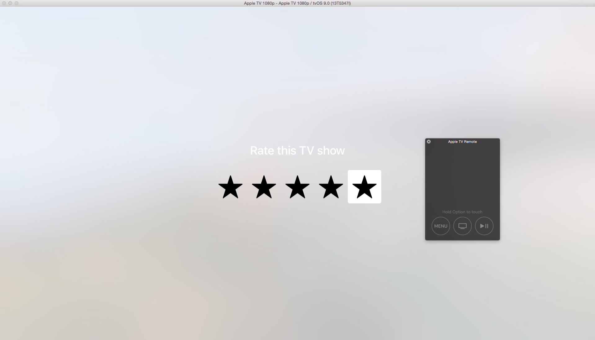

# tvOS.SampleGuide

Just a little experiment setting up a local Node.js server to provide application JavaScript file for an [Apple TV client-server app](http://martinnormark.com/tvos-client-server-experiment/) to load a sample template, that looks like this:

</img>

The remote us quite cool - you hold down the Option/Alt key and hover the touch area to simulate swipes.
